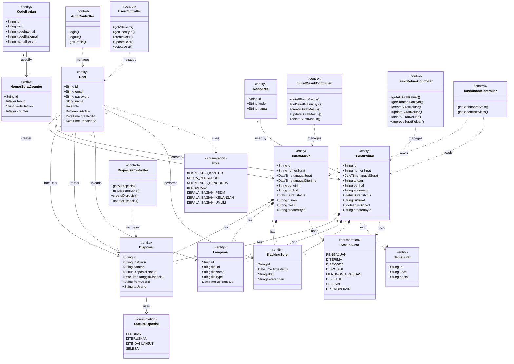

# Class Diagram - Sistem AMANAT

## Deskripsi

Class Diagram lengkap untuk Sistem Manajemen Surat AMANAT yang menggambarkan:

- **<<entity>>** - Model database
- **<<enumeration>>** - Enum/tipe data
- **<<control>>** - Controller classes

---

## Class Diagram (Mermaid Format)

---

## Legend

| Simbol               | Nama            | Keterangan                                             |
| -------------------- | --------------- | ------------------------------------------------------ |
| `◆` (filled diamond) | **Composition** | Strong ownership - child tidak bisa exist tanpa parent |
| `→` (solid arrow)    | **Association** | Relasi umum dengan multiplicity                        |
| `..>` (dashed arrow) | **Dependency**  | Uses/manages relationship                              |

---

## Stereotypes

| Stereotype        | Keterangan             | Contoh                         |
| ----------------- | ---------------------- | ------------------------------ |
| `<<entity>>`      | Model database / tabel | User, SuratMasuk, Disposisi    |
| `<<enumeration>>` | Tipe data enum         | Role, StatusSurat              |
| `<<control>>`     | Controller class       | AuthController, UserController |

---

## Ringkasan Relasi

### 1. Composition (◆)

Child tidak bisa exist tanpa parent.

| Parent      | Child                              |
| ----------- | ---------------------------------- |
| SuratMasuk  | Disposisi, Lampiran, TrackingSurat |
| SuratKeluar | Disposisi, Lampiran, TrackingSurat |

### 2. Association (→)

Relasi umum antar entity.

| Dari        | Ke                | Multiplicity |
| ----------- | ----------------- | ------------ |
| User        | SuratMasuk        | 1 to \*      |
| User        | SuratKeluar       | 1 to \*      |
| User        | Disposisi         | 1 to \*      |
| User        | Lampiran          | 1 to \*      |
| User        | TrackingSurat     | 1 to \*      |
| SuratKeluar | JenisSurat        | \* to 0..1   |
| KodeArea    | SuratKeluar       | 1 to \*      |
| KodeBagian  | NomorSuratCounter | 1 to \*      |

### 3. Dependency (..>)

Penggunaan class lain.

| Dari        | Ke              | Keterangan                       |
| ----------- | --------------- | -------------------------------- |
| User        | Role            | Menggunakan enum Role            |
| SuratMasuk  | StatusSurat     | Menggunakan enum StatusSurat     |
| SuratKeluar | StatusSurat     | Menggunakan enum StatusSurat     |
| Disposisi   | StatusDisposisi | Menggunakan enum StatusDisposisi |
| Controllers | Entities        | Controller mengelola entity      |

---

> **Cara Export ke Draw.io:**
>
> 1. Buka [draw.io](https://app.diagrams.net/)
> 2. Pilih **Insert → Advanced → Mermaid**
> 3. Paste kode Mermaid di atas
